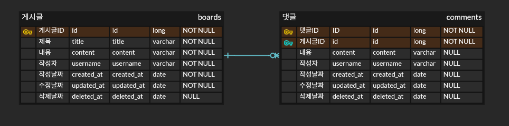

# 개요

- `Mysql`과 `JPA`를 활용하여 게시물과 댓글 기능을 구현하는 브랜치
    - `Mokito`를 활용한 비즈니스 로직`(Service)` **단위테스트**
    - `MockMvc`를 활용한 `Controller` **통합테스트**
    - `Response, ErrorCode` 및 `Exception` Custom
    - `Swagger UI` 적용.

---

# ERD


---

# 구현 기능

## `Entity`

```java
@Entity
@Getter
@NoArgsConstructor(access = AccessLevel.PROTECTED)
@Table(name = "boards")
@SQLDelete(sql = "UPDATE boards SET deleted_at = NOW() WHERE id = ?")
@Where(clause = "deleted_at IS NULL")
public class Board {
    @Id
    @GeneratedValue(strategy = GenerationType.IDENTITY)
    private Long id;
    @Column(nullable = false)
    private String title;
    @Column(nullable = false)
    private String content;
    @Column(nullable = false, updatable = false)
    private String username;

    @OneToMany(mappedBy = "board", cascade = CascadeType.REMOVE, orphanRemoval = true)
    private List<Comment> comments;

    @Column(name = "created_at", nullable = false, updatable = false)
    private LocalDateTime createdAt;
    @Column(name = "updated_at", nullable = false)
    private LocalDateTime updatedAt;
    @Column(name = "deleted_at")
    private LocalDateTime deletedAt;

    @PrePersist
    private void onCreate() {
        this.createdAt = LocalDateTime.now();
        this.updatedAt = LocalDateTime.now();
    }

    @PreUpdate
    private void onUpdate() {
        this.updatedAt = LocalDateTime.now();
    }

    private Board(String title, String content, String username) {
        this.title = title;
        this.content = content;
        this.username = username;
    }

    public static Board create(String title, String content, String username) {
        return new Board(title, content, username);
    }

    public void update(String title, String content) {
        this.title = title;
        this.content = content;
    }
}
```

```java
package com.brightcha.boardcomment.entity;

import jakarta.persistence.*;
import lombok.AccessLevel;
import lombok.Getter;
import lombok.NoArgsConstructor;
import org.hibernate.annotations.SQLDelete;
import org.hibernate.annotations.Where;

import java.time.LocalDateTime;

@Entity
@Getter
@Table(name = "comments")
@NoArgsConstructor(access = AccessLevel.PROTECTED)
@SQLDelete(sql = "UPDATE comments SET deleted_at = NOW() WHERE id = ?")
@Where(clause = "deleted_at IS NULL")
public class Comment {
    @Id
    @GeneratedValue(strategy = GenerationType.IDENTITY)
    private Long id;
    @Column(nullable = false)
    private String content;
    @Column(nullable = false)
    private String username;

    @JoinColumn(name = "board_id", nullable = false, updatable = false)
    @ManyToOne
    private Board board;

    @Column(name = "created_at", nullable = false, updatable = false)
    private LocalDateTime createdAt;
    @Column(name = "updated_at", nullable = false)
    private LocalDateTime updatedAt;
    @Column(name = "deleted_at")
    private LocalDateTime deletedAt;

    @PrePersist
    private void onCreate() {
        this.createdAt = LocalDateTime.now();
        this.updatedAt = LocalDateTime.now();
    }

    @PreUpdate
    private void onUpdate() {
        this.updatedAt = LocalDateTime.now();
    }

    private Comment(String content, String username, Board board) {
        this.content = content;
        this.username = username;
        this.board = board;
    }

    public static Comment create(String content, String username, Board board) {
        return new Comment(content, username, board);
    }

    public void update(String content) {
        this.content = content;
    }
}

```

- 정적 팩토리 메서드 사용`(public static)` 을 통해, `create` 및 `update` 명시적 사용.
- `@Table` 어노테이션을 통해 `“comments”` 테이블 이름 지정
- `@NoArgsConstructor(access = AccessLevel.PROTECTED)` 어노테이션을 통해
  `Protected` 접근제한자를 가진 생성자 생성
- `@SQLDeleted(sql = “UPDATE comments SET deleted_at = NOW() WHERE id = ?”)`어노테이션과
  `deleted_at`을 활용하여 소프트 딜리트 구현
- `@Where(clause = “deleted_at IS NULL”)` 을 통해
  모든 상황에서 삭제되지 않은 데이터만 조회.
- `@PrePersist`
  : 어노테이션이 붙은 메서드는 `Entity`가 `DB`에 저장되기 전 `JPA Provider`에 의해 자동 호출됨
  → `Entity`가 영속화 되기 직전 실행되어야 하는 메서드를 표시.
  - `@PreUpdate`
  : 어노테이션이 붙은 메서드는 `Entity` 변경 사항이 `DB`와 동기화 되기 전
  `JPA Provider`에 의해 자동 호출됨
  → `Entity`가 업데이트 되기 직전 실행되어야 하는 메서드를 표시

---

## `Mokito`를 활용한 `Service` 단위테스트

```java
@ExtendWith(MockitoExtension.class)
@DisplayName("게시물 서비스 테스트")
class BoardServiceImplTest {

    @InjectMocks
    private BoardServiceImpl boardService;
    @Mock
    private BoardRepository boardRepository;
```

- `@ExtendWith(MockitoExtension.class)`
  : 단위 테스트에 공통으로 사용할 확장 기능을 선언해주는 역할.
  → `MockitoExtension.class`를 활용하여 단위테스트를 진행하겠다.
  - `@Mock`
  : 해당 테스트에서 사용할 가상의 인스턴스를 생성하는 역할
  - `@InjectMocks`
  : 단위 테스트에서 테스트하고자 하는 인스턴스를 생성, 해당 객체의 의존성을 자동으로 주입.

```java
    @Test
    @DisplayName("단일 게시물 조회")
    void getBoard() {
        // given: 필요한 데이터와 Mock 객체의 동작 설정
        Long boardId = 1L;
        Board board = Board.create("제목", "내용", "작성자");
        ReflectionTestUtils.setField(board, "id", boardId);

        when(boardRepository.findById(boardId)).thenReturn(Optional.of(board));

        // when: 테스트 대상 메서드 호출
        BoardResponseDto boardResponseDto = boardService.getBoard(boardId);

        // then: 결과 검증
        assertThat(boardResponseDto.id()).isEqualTo(boardId);
        verify(boardRepository).findById(boardId);
    }
```

- `ReflectionTestUtils.*setField*(board, "id", boardId);`
  : `board` 의 `“id”`변수의 값을 `boardId`로 지정해준다는 의미
  → 접근 및 변경이 어려운 경우 사용.
  - `*when*(boardRepository.findById(boardId)).thenReturn(Optional.*of*(board));`
  : `when` 내부가 실행될 때, 결과가 항상 `thenReturn` 내부의 객체로 설정함.
  - `*verify*(boardRepository).findById(boardId);`
  : `*verify`* 내부 객체의 특정 메서드가 호출됨을 검증.

```java
    @Test
    @DisplayName("게시물 목록 조회")
    void getBoards() {
        // given: 필요한 데이터와 Mock 객체의 동작 설정
        Board board = Board.create("제목", "내용", "작성자");
        List<Board> mockBoards = List.of(board);
        when(boardRepository.findAll()).thenReturn(mockBoards);

        // when: 테스트 대상 메서드 호출
        List<BoardResponseDto> boards = boardService.getBoards();

        // then: 결과 검증
        assertThat(boards).hasSize(1);
        verify(boardRepository).findAll();
    }
```

- `*assertThat*(boards).hasSize(1);`
  : 해당 객체가 가진 `Size`를 검증

```java
    @Test
    @DisplayName("게시물 저장")
    void createBoard() {
        // given: 필요한 데이터와 Mock 객체의 동작 설정
        Long boardId = 1L;
        BoardRequestDto boardRequestDto = new BoardRequestDto("제목", "내용", "작성자");

        when(boardRepository.save(any(Board.class))).thenAnswer(invocation -> {
            Board board = invocation.getArgument(0);
            ReflectionTestUtils.setField(board, "id", boardId);
            return board;
        });

        // when: 테스트 대상 메서드 호출
        BoardResponseDto boardResponseDto = boardService.createBoard(boardRequestDto);

        // then: 결과 검증
        assertThat(boardResponseDto.id()).isEqualTo(boardId);
        verify(boardRepository).save(any(Board.class));
    }
```

- `*when*(boardRepository.save(*any*(Board.class)))`
  : 특정 클래스 타입 인자를 가진 Mock 객체의 메서드 호출이 있을 때,
  - `.thenAnswer(return board)`
  : 해당 값을 반환할 것을 설정.
  - `invocation`
  : `Mock` 객체의 메서드가 호출될 때의 정보를 담고 있는 객체. 호출 시 전달된 인수 등을 제공.
  - `Board board = invocation.getArgument(0);`
  : `invocation`이 가진 첫 번째 인자를 `board`에 담겠다.

  ⇒ 매개변수로 주어진 첫 번째 인자가 그대로 담긴다.

  이후 해당 변수의 id 값을 설정하고 해당 객체를 반환할 것을 설정한다.


```java
    @Test
    @DisplayName("게시물 수정")
    void updateBoard() {
        // given: 필요한 데이터와 Mock 객체의 동작 설정
        Long boardId = 1L;

        Board beforeBoard = Board.create("제목", "내용", "작성자");
        ReflectionTestUtils.setField(beforeBoard, "id", boardId);

        BoardRequestDto boardRequestDto = new BoardRequestDto("수정된 제목", "수정된 내용", "작성자");

        when(boardRepository.findById(boardId)).thenReturn(Optional.of(beforeBoard));
        when(boardRepository.save(any(Board.class))).thenAnswer(invocation -> invocation.getArgument(0));

        // when: 테스트 대상 메서드 호출
        BoardResponseDto boardResponseDto = boardService.updateBoard(boardId, boardRequestDto);

        // then: 결과 검증
        assertThat(boardResponseDto.id()).isEqualTo(boardId);
        assertThat(boardResponseDto.title()).isEqualTo(boardRequestDto.title());
        assertThat(boardResponseDto.content()).isEqualTo(boardRequestDto.content());

        verify(boardRepository).findById(boardId);
        verify(boardRepository).save(any(Board.class));
    }
```

- `*when*(boardRepository.save(*any*(Board.class))).thenAnswer(invocation -> invocation.getArgument(0));`
  : 받은 그대로 반환하겠다.

```java
    @Test
    @DisplayName("게시물 삭제")
    void deleteBoard() {
        // given: 필요한 데이터와 Mock 객체의 동작 설정
        Long boardId = 1L;
        Board board = Board.create("제목", "내용", "작성자");
        ReflectionTestUtils.setField(board, "id", boardId);

        when(boardRepository.findById(boardId)).thenReturn(Optional.of(board));
        doNothing().when(boardRepository).delete(board);

        // when: 테스트 대상 메서드 호출
        boardService.deleteBoard(boardId);

        // then: 결과 검증
        verify(boardRepository).findById(boardId);
        verify(boardRepository).delete(board);
    }
```

- `*doNothing*().when(boardRepository).delete(board);`
  : 아무일도 일어나지 않을 것을 정의함.

---

## `MockMvc`를 활용한 `Controller` **통합테스트**

```java
@SpringBootTest
@AutoConfigureMockMvc
@Transactional
@DisplayName("게시물 컨트롤러 테스트")
class BoardControllerTest {

    @Autowired
    MockMvc mockMvc;
    @Autowired
    private BoardService boardService;
    @Autowired
    private ObjectMapper objectMapper;
```

- `@AutoConfigureMockMvc`
  : `MockMvc`를 사용하기 위해 테스트 환경에서 **`MockMvc`**를 자동으로 구성하는 어노테이션
  ⇒ `MockMvc`를 사용하려면 `@Autowired`로 주입하거나, 테스트 메서드의 매개변수로 주입받아야 함
  - `@Transactional`
  : 해당 클래스의 메서드들이 완료되면 롤백한다는 의미.
  - `ObjectMapper`
  : `RequestBody`에 들어갈 `Json` 객체의 문자열을 생성하기 위한 객체

  > `Jackson` 라이브러리에서 제공하는 객체
  `Java` 객체를 `JSON` 문자열로 변환하거나, `JSON` 문자열을 `Java` 객체로 변환하는 데 사용
>

```java
    @Test
    @DisplayName("게시물 목록 조회")
    void getBoards() throws Exception {
        // given: 게시물이 존재한다고 가정
        // when: 게시물 목록 조회 API 호출
        mockMvc.perform(get("/api/boards")
                        .contentType(MediaType.APPLICATION_JSON))
                // then: 응답 상태 검증
                .andExpect(status().isOk());
    }
```

- `mockMvc.perform(*get*("/api/boards").contentType(MediaType.*APPLICATION_JSON*))`
  : `get()` 방식의`()` 내부 `URL`로 `API`를 호출함을 의미.
  - `.andExpect(*status*().isOk());`
  : 예상하는 상태코드가 200 임을 의미

```java
    @Test
    @DisplayName("게시물 단일 조회")
    void getBoard() throws Exception {
        // given: 게시물 생성
        BoardResponseDto boardResponseDto = createBoard("제목", "내용", "작성자");

        // when: 단일 게시물 조회 API 호출
        mockMvc.perform(get("/api/boards/{boardId}", boardResponseDto.id())
                        .contentType(MediaType.APPLICATION_JSON))
                // then: 응답 데이터 검증
                .andExpect(jsonPath("$.id").value(boardResponseDto.id()))
                .andExpect(jsonPath("$.title").value(boardResponseDto.title()))
                .andExpect(jsonPath("$.content").value(boardResponseDto.content()))
                .andExpect(jsonPath("$.username").value(boardResponseDto.username()))
                .andDo(print());
    }
```

- `.andExpect(
*jsonPath*("$.id").value(boardResponseDto.id()))`
: JSON 응답의 경로를 지정하여 값을 가져옴.
- **`$`**: JSON 객체의 **루트(root)**

    ⇒ 응답 객체의 `id` 값이 `boardResponseDto.id()`임을 예상한다는 의미.


```java
    @Test
    @DisplayName("게시물 생성")
    void createBoard() throws Exception {
        // given: 게시물 생성 요청 데이터 준비
        BoardRequestDto boardRequestDto = new BoardRequestDto("제목", "내용", "작성자");
        String requestBody = objectMapper.writeValueAsString(boardRequestDto);

        // when: 게시물 생성 API 호출
        mockMvc.perform(post("/api/boards")
                        .contentType(MediaType.APPLICATION_JSON)
                        .content(requestBody))
                // then: 응답 데이터 검증
                .andExpect(status().isOk())
                .andExpect(jsonPath("$.title").value(boardRequestDto.title()))
                .andExpect(jsonPath("$.content").value(boardRequestDto.content()))
                .andExpect(jsonPath("$.username").value(boardRequestDto.username()))
                .andDo(print());
    }
```

- `String requestBody = objectMapper.writeValueAsString(boardRequestDto);`
  : `objectMapper`를 통해 `boardRequestDto` 객체를 `Json` 문자열로 변경하여 변수에 담는 과정.
  - `.content(requestBody)`
  : `Json` 문자열이 담긴 변수를 `mockMvc` API 호출 내용`(RequestBody)`에 담겠다는 의미.

---

## `Response, ErrorCode` 및 `Exception` Custom

### ErrorCode

```java
@AllArgsConstructor
@Getter
public enum ErrorCode {

    DUPLICATED_USER_EMAIL(HttpStatus.CONFLICT, "User email is duplicated"),
    DUPLICATED_USER_NICKNAME(HttpStatus.CONFLICT, "User nickname is duplicated"),
    USER_NOT_FOUND(HttpStatus.NOT_FOUND, "User not founded"),
    INVALID_PASSWORD(HttpStatus.UNAUTHORIZED, "Password is invalid"),
    INVALID_TOKEN(HttpStatus.UNAUTHORIZED, "Token is invalid"),
    INTERNAL_SERVER_ERROR(HttpStatus.INTERNAL_SERVER_ERROR, "Internal Server error");

    private final HttpStatus status;
    private final String message;
}
```

- `Http 상태코드`와 설명을 담는 `enum`타입의 `ErrorCode.`

### Response<T>

```java
@AllArgsConstructor
@Getter
public class Response<T> {
    private String resultCode;
    private T result;

    public static Response<Void> error(String errorCode) {
        return new Response<Void>(errorCode, null);
    }

    public static Response<Void> success() {
        return new Response<Void>("SUCCESS", null);
    }

    public static <T> Response<T> success(T result) {
        return new Response<>("SUCCESS", result);
    }
}
```

- 문자열의 `resultCode`와 특정 타입을 담을 `result`를 멤버로 가진 `Response`

### CustomException

```java
@Getter
@AllArgsConstructor
public class BoardCommentException extends RuntimeException {

    private ErrorCode errorCode;
    private String message;

    public BoardCommentException(ErrorCode errorCode) {
        this.errorCode = errorCode;
        this.message = null;
    }

    @Override
    public String getMessage() {
        if (message == null) {
            return errorCode.getMessage();
        }
        return String.format("%s. %s", errorCode.getMessage(), message);
    }
}

```

- 위에서 생성한 Custom `ErrorCode`와 문자열의 `message`를 담는 `Exception`

### GlobalControllerAdvice

```java
@RestControllerAdvice
@Slf4j
public class GlobalControllerAdvice {

    @ExceptionHandler(BoardCommentException.class)
    public ResponseEntity<?> boardCommentException(final BoardCommentException e) {
        log.error("Error occur {}", e.toString());
        return ResponseEntity.status(e.getErrorCode().getStatus())
                .body(Response.error(e.getErrorCode().name()));

    }

    @ExceptionHandler(RuntimeException.class)
    public ResponseEntity<?> runtimeException(final RuntimeException e) {
        log.error("Error occur {}", e.toString());
        return ResponseEntity.status(HttpStatus.INTERNAL_SERVER_ERROR)
                .body(Response.error(ErrorCode.INTERNAL_SERVER_ERROR.name()));
    }
}
```

- 전역에서 발생하는 예외를 모아서 처리하는 `GlobalControllerAdvice`
- `@RestControllerAdvice`
  : `@ControllerAdvice` + `@ResponseBody`가 결합된 어노테이션
  - `@ExceptionHandler()`
  : `()` 내부의 클래스에 해당하는 예외 발생시 해당 어노테이션이 붙은 메서드 호출.

---

## `Swagger UI` 적용.

### build.gradle 라이브러리 추가

```java
// swagger
implementation 'org.springdoc:springdoc-openapi-starter-webmvc-ui:2.7.0'
```

### SwaggerConfig 추가.

```java
@Configuration
public class SwaggerConfig {

    @Bean
    public OpenAPI openAPI() {
        return new OpenAPI()
                .components(new Components())
                .info(apiInfo());
    }

    private Info apiInfo() {
        return new Info()
                .title("API Test") // API의 제목
                .description("Let's practice Swagger UI") // API에 대한 설명
                .version("1.0.0"); // API의 버전
    }
}
```

---

### ResponseEntity의 응답


### Custom Response의 응답


⇒ Custom을 통해 결과가 성공인지 에러인지 확인 가능.